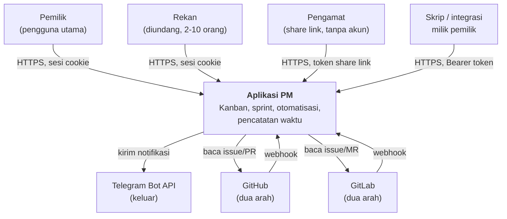
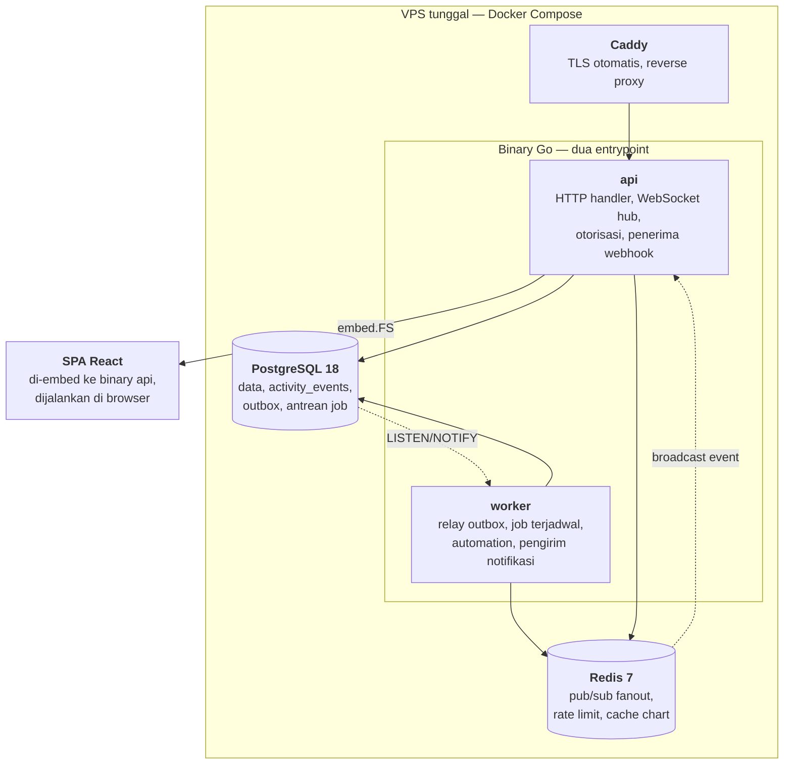
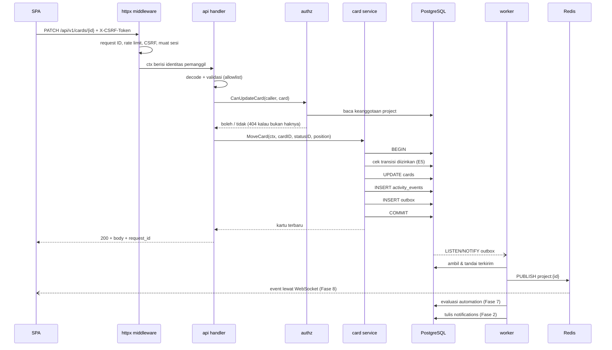

# Arsitektur

Keputusan stack beserta alasannya ada di
[ADR-0001](adr/0001-stack-react-go-postgresql.md). Dokumen ini menjelaskan
bentuknya.

## C4 Level 1 — Konteks



Yang **tidak** ada di diagram ini, dan itu disengaja: penyedia identitas
eksternal (non-goal SSO), penyedia pembayaran (tidak dijual), penyimpanan objek
(attachment adalah non-goal), dan penyedia email pihak ketiga — email hanya
dipakai untuk undangan dan reset password lewat SMTP biasa.

## C4 Level 2 — Container



Empat container, satu mesin. Jumlah ini dipilih sadar: setiap container
tambahan adalah sesuatu yang harus di-monitor, di-backup, dan di-upgrade oleh
satu orang.

### Kenapa `api` dan `worker` dipisah walau satu repo

Satu basis kode, dua entrypoint (`cmd/api`, `cmd/worker`), dua container dari
image yang sama. Alasannya:

- Job yang berat (rebalance posisi, ekspor penuh, rekalkulasi chart) tidak
  boleh memakan CPU yang sedang melayani permintaan pengguna.
- `worker` bisa di-restart saat mengubah aturan automation tanpa memutus
  koneksi WebSocket yang sedang terbuka di `api`.
- Kalau `worker` mati, aplikasi tetap bisa dipakai — notifikasi dan automation
  tertunda, bukan hilang, karena antreannya durabel di PostgreSQL.

### Kenapa SPA di-embed ke binary

Satu artefak deploy, satu origin, tidak ada CORS, tidak ada versi frontend yang
berbeda dari versi backend yang melayaninya. Konsekuensinya: mengubah satu
baris CSS berarti build ulang binary. Pada frekuensi rilis proyek ini, itu
pertukaran yang jelas menguntungkan.

## Struktur backend

```
backend/
├── cmd/
│   ├── api/main.go             # server HTTP + hub WebSocket
│   └── worker/main.go          # relay outbox + job
├── internal/
│   ├── config/                 # muat & validasi env, gagal cepat saat start
│   ├── postgres/               # pool pgx, transaksi, health
│   ├── redis/                  # klien, rate limiter — cache & fanout menyusul
│   ├── httpx/                  # router, middleware, bentuk error, request ID
│   ├── authz/                  # policy — satu-satunya tempat izin diputuskan
│   ├── fracdex/                # fractional index (ADR-0003)
│   ├── events/                 # Publisher/Subscriber, implementasi outbox
│   ├── realtime/               # hub WebSocket, fanout via Redis
│   ├── jobs/                   # definisi & worker river
│   └── modules/
│       ├── identity/           # user, session, invitation, password reset
│       ├── project/            # project, member, board, column, status, label
│       ├── card/               # card, checklist, link, comment
│       ├── sprint/             # sprint, epic, backlog
│       ├── timelog/            # F1-F3
│       ├── automation/         # E2, E5 — mesin aturan & transisi
│       ├── search/             # query filter, full-text (C5, C6, C7)
│       ├── report/             # D5-D7, F3, F4
│       ├── vcs/                # Provider + github/ + gitlab/ (ADR-0006)
│       └── telegram/           # H3
├── db/
│   └── migrations/             # goose, maju saja — terpusat, tidak per modul
└── web/                        # hasil build SPA, di-embed
```

Setiap modul di `internal/modules/` punya bentuk yang sama — lihat
[ADR-0008](adr/0008-struktur-modular-backend.md):

```
modules/<modul>/
├── domain/                     # entitas + sentinel error. Tidak mengimpor apa pun dari repo ini
├── repository/                 # sqlc hasil generate + akses data
│   └── queries/                # sumber .sql milik modul ini
├── service/                    # logika bisnis, batas transaksi
├── handler/                    # decode → validasi → panggil service → encode
└── route/                      # pendaftaran route + middleware khusus modul
```

Aturan yang berlaku di struktur ini:

- **Arah ketergantungan satu arah:** `route → handler → service → repository →
  domain`. Tidak ada panah balik. `domain` tidak mengimpor paket lain di repo
  ini.
- **Modul tidak query tabel milik modul lain.** Pembacaan lintas modul lewat
  service pemiliknya. Ini yang membuat batas modul berarti sesuatu, dan yang
  mencegah `sqlc` melahirkan tipe `Card` di enam paket berbeda.
- **Alias impor lintas modul berpola `<modul><lapisan>`** — `carddom`,
  `cardrepo`, `cardsvc`, `cardhttp`, `cardroute` — ditegakkan linter `importas`
  di `.golangci.yml`. Konvensi yang hanya tertulis akan menyimpang pada modul
  kelima.
- **Tidak ada paket `utils`, `helpers`, `common`, atau `shared`.** Dilarang oleh
  `rules/20-go.md` dan oleh [glossary.md](glossary.md).
- **Interface didefinisikan di sisi konsumen.** `events.Publisher` hidup di
  paket yang memakainya, bukan di paket yang mengimplementasikannya. Begitu pula
  interface pembaca keanggotaan yang dipakai `authz`.
- **Batas transaksi ada di `service`, bukan di `repository`.** Satu unit bisnis,
  satu transaksi.
- **Semua izin diputuskan di `internal/authz`**, di luar modul. Handler
  bertanya, tidak memutuskan. Ini yang membuat
  [authorization.md](authorization.md) bisa diuji sebagai satu kesatuan, bukan
  tersebar di puluhan modul.

### Alur satu permintaan yang mengubah data

Contoh: memindahkan kartu ke status lain.



Tiga hal yang penting dari alur ini:

1. **`UPDATE`, `activity_events`, dan `outbox` berada dalam satu transaksi.**
   Tidak ada keadaan di mana kartu berubah tapi riwayatnya hilang.
2. **Panggilan eksternal tidak pernah terjadi di dalam transaksi** —
   `rules/25-postgresql.md`. Telegram dan GitHub dipanggil oleh `worker`,
   setelah commit.
3. **Otorisasi terjadi sebelum service dipanggil**, dan mengembalikan `404`
   untuk sumber daya yang bukan hak pemanggil, bukan `403`, supaya keberadaannya
   tidak bocor.

## Struktur frontend

```
frontend/src/
├── app/              # router, provider, layout, error boundary
├── features/
│   ├── board/        # kanban, drag & drop, kolom
│   ├── card/         # detail kartu, checklist, komentar, relasi
│   ├── sprint/       # backlog, sprint, epic
│   ├── views/        # tabel, kalender, timeline
│   ├── report/       # burndown, velocity, CFD, dashboard
│   ├── timelog/
│   ├── automation/
│   └── settings/
├── components/ui/    # primitif tanpa logika domain
├── lib/
│   ├── api/          # klien fetch, tipe hasil generate, konversi penamaan
│   ├── realtime/     # klien WebSocket → tulis ke cache TanStack Query
│   └── filter/       # bentuk query filter, dipakai C5, C6, C7
└── stores/           # Zustand — HANYA state UI
```

### Aturan state yang menentukan biaya Fase 8

Ini bukan preferensi gaya. Fase 8 (realtime) hanya murah kalau aturan ini
dipegang sejak Fase 1:

| Jenis state | Pemilik | Contoh |
|---|---|---|
| Data dari server | **TanStack Query, satu-satunya** | Kartu, board, sprint, komentar |
| State antarmuka | Zustand | Panel terbuka, mode tampilan, seleksi bulk, tema |
| State URL | TanStack Router search params | Filter aktif, kartu yang dibuka, tampilan |

Data server **tidak pernah** disalin ke Zustand. Alasannya: klien WebSocket di
Fase 8 bekerja dengan menulis ke cache TanStack Query. Kalau ada salinan kedua
di Zustand, salinan itu akan basi dan setiap layar harus diperbaiki satu per
satu.

Konsekuensi lain: filter disimpan di URL, sehingga tampilan apa pun bisa
di-bookmark dan dibagikan — dan C6 (saved filter) tinggal menyimpan string
query, bukan struktur baru.

### Yang di-lazy load

Gantt (C4), chart (D5–D7), dan editor Markdown adalah dependensi terberat.
Ketiganya dimuat saat rutenya dibuka, tidak masuk bundel awal. Anggaran ukuran
ada di [nfr.md](nfr.md).

## Batas yang ditetapkan sekarang

Ditulis di sini supaya tidak diputuskan ulang oleh orang yang berbeda di fase
yang berbeda.

| Pertanyaan | Jawaban |
|---|---|
| Siapa pemilik tabel? | Satu backend, satu database. Tidak ada kepemilikan terbagi |
| Siapa otoritas autentikasi? | `internal/modules/identity`. Tidak ada yang lain |
| Di mana izin diputuskan? | `internal/authz`, di luar modul. Handler bertanya, tidak memutuskan |
| Di mana logika bisnis? | `modules/<m>/service`. Handler hanya decode → validasi → panggil → encode |
| Bolehkah satu modul query tabel modul lain? | Tidak. Lewat service pemiliknya ([ADR-0008](adr/0008-struktur-modular-backend.md)) |
| Siapa yang memanggil layanan eksternal? | `worker`, selalu, setelah commit |
| Di mana penamaan JSON dikonversi? | `lib/api` di frontend, satu tempat |
| Apa sumber kebenaran kontrak API? | `docs/api/openapi.yaml`. Tipe TS digenerate darinya, tidak pernah ditulis tangan |
| Bagaimana skema berubah? | Migration goose, maju saja, tidak pernah diedit setelah merge |
