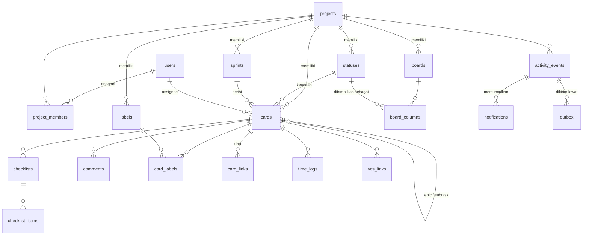

# Model Data

Skema adalah keputusan yang paling sulit dibatalkan di seluruh sistem. Kode
bisa ditulis ulang dalam sehari; skema yang salah akan menemani proyek ini
bertahun-tahun.

Kolom **Fase** menunjukkan kapan fiturnya dibangun. **Semua tabel di bawah
dibuat di Fase 0**, termasuk yang fiturnya baru muncul di Fase 7 — alasannya
ada di [roadmap.md](roadmap.md#yang-harus-diputuskan-di-fase-0-walau-dibangun-jauh-kemudian).
Yang ditunda hanya kode yang memakainya, bukan tabelnya.

## Konvensi yang berlaku di seluruh skema

| Aturan | Nilai | Alasan |
|---|---|---|
| Primary key | `uuid` v7, **dihasilkan aplikasi**, dengan `DEFAULT uuidv7()` sebagai jaring pengaman | Terurut waktu (ramah indeks) tanpa membocorkan jumlah data seperti ID berurutan (`rules/25-postgresql.md`). Lihat [ADR-0007](adr/0007-postgresql-18.md) |
| Versi PostgreSQL | 18, di `local` maupun `production` | [ADR-0007](adr/0007-postgresql-18.md) |
| String | `text`, tidak pernah `varchar(n)` | Batas panjang nyaris selalu jadi salah suatu hari |
| Waktu | `timestamptz`, disimpan UTC | `timestamp` tanpa zona menghasilkan bug yang baru muncul saat ada pengguna di zona lain |
| Tanggal murni | `date` untuk `start_date` / `due_date` | Jatuh tempo adalah tanggal di zona pengguna, bukan titik waktu |
| Enum | `text` + `CHECK` | Tipe enum PostgreSQL sulit diubah — menghapus nilai butuh membuat ulang tipe |
| Data tak berstruktur | `jsonb`, tidak pernah `json` | `json` disimpan sebagai teks dan tidak bisa diindeks dengan baik |
| Nullable | Harus punya alasan yang bisa dijelaskan | `NOT NULL` adalah default |
| Urutan | `text COLLATE "C"` — fractional index | [ADR-0003](adr/0003-urutan-kartu-fractional-index.md) |
| Penghapusan | `deleted_at timestamptz` (sampah, bisa di-undo) + `archived_at timestamptz` (arsip, sengaja) | Dua konsep berbeda: I2 arsip, I3 sampah |
| Unique + soft delete | Selalu indeks unik **parsial** dengan `WHERE deleted_at IS NULL` | Tanpa ini, nama yang dihapus memblokir nama baru |
| Foreign key | Selalu berindeks, `ON DELETE` ditentukan sengaja | PostgreSQL tidak membuat indeks FK otomatis |

**Setiap kolom `id uuid PRIMARY KEY` di seluruh DDL di bawah dibaca sebagai
`id uuid PRIMARY KEY DEFAULT uuidv7()`.** Ditulis sekali di sini alih-alih
diulang 28 kali. Nilainya tetap dihasilkan aplikasi — ID dibutuhkan sebelum
`INSERT`, untuk menulis `activity_events` yang merujuk baris itu di dalam
transaksi yang sama. `DEFAULT` hanya menutup `INSERT` manual dari psql, seed,
dan migration. Pengecualian: `outbox.id` yang memakai `bigint identity`, karena
urutan pengiriman penting dan ID-nya tidak pernah terlihat pengguna.

**Soft delete ditegakkan lewat view**, bukan lewat disiplin. Setiap tabel yang
punya `deleted_at` mendapat view `<nama>_live` yang sudah menyaringnya, dan
seluruh query `sqlc` membaca dari view. Satu `WHERE` yang terlupa berarti
kebocoran data, dan disiplin manusia bukan mekanisme yang bisa diandalkan.

**View ditulis dengan daftar kolom eksplisit, bukan `SELECT *`.** PostgreSQL
mengembangkan `*` saat view dibuat lalu membekukannya — view yang didefinisikan
dengan `*` diam-diam berhenti menampilkan kolom yang ditambahkan kemudian, dan
kebocoran soft delete adalah hal yang tidak ada yang sadari sampai terlambat.
`TestLiveViewsMatchTheirTables` menyisir setiap tabel ber-`deleted_at` dan
membuktikan view-nya masih sepadan; ia otomatis mencakup tabel yang belum ada.

## Konvensi migration

| Aturan | Nilai | Alasan |
|---|---|---|
| Perkakas | goose, **maju saja** | `cmd/migrate` sengaja tidak punya perintah `down`. Tombol rollback yang ada adalah tombol yang ditekan jam tiga pagi |
| Penamaan | `NNNNN_nama.sql` berurutan | Nomor urut membuat urutannya terbaca saat review; timestamp tidak |
| Baris pertama setiap berkas | `SET lock_timeout = '5s';` dan `SET statement_timeout = '5min';` | Tanpa `lock_timeout`, migration mengantre di belakang query panjang dan semua yang datang sesudahnya mengantre di belakang migration. Satu laporan lambat menghentikan seluruh database |
| Indeks pada tabel yang dibuat di berkas yang sama | `-- squawk-ignore require-concurrent-index-creation` | Belum ada baris dan belum ada sesi lain, dan `CONCURRENTLY` mustahil di dalam transaksi |
| Indeks pada tabel yang **sudah ada** | `-- +goose NO TRANSACTION` + `CREATE INDEX CONCURRENTLY`, di berkas tersendiri | Di sinilah `require-concurrent-index-creation` berguna, dan ia tetap menyala — lihat `.squawk.toml` |
| Constraint `UNIQUE` | Dideklarasikan **di dalam `CREATE TABLE`**, bukan lewat `ALTER TABLE ... ADD CONSTRAINT` | `ALTER TABLE` mengambil `ACCESS EXCLUSIVE` lock dan membangun indeksnya sambil menahan lock itu — memblokir baca **dan** tulis. Di dalam `CREATE TABLE` tidak ada yang bisa dikunci |
| Menambah FK ke tabel yang sudah ada | `ADD CONSTRAINT ... NOT VALID` lalu `VALIDATE CONSTRAINT` | `NOT VALID` melewati pemindaian baris lama dengan lock ringan; `VALIDATE` memeriksanya tanpa memblokir tulis |
| Letak `-- squawk-ignore` | Tepat di atas **baris yang dilaporkan**, bukan di atas pernyataannya | Untuk temuan tingkat kolom, pragma di atas `CREATE TABLE` tidak berpengaruh — ia harus menempel pada baris kolomnya |

## ERD — inti



---

## Fase 0 — Identitas & akses

```sql
CREATE TABLE users (
    id             uuid PRIMARY KEY,
    email          text NOT NULL,                       -- 🔒 data pribadi
    name           text NOT NULL,                       -- 🔒 data pribadi
    password_hash  text NOT NULL,                       -- 🔒 Argon2id
    timezone       text NOT NULL DEFAULT 'Asia/Jakarta',
    is_owner       boolean NOT NULL DEFAULT false,
    created_at     timestamptz NOT NULL DEFAULT now(),
    updated_at     timestamptz NOT NULL DEFAULT now(),
    deactivated_at timestamptz,
    deleted_at     timestamptz
);

-- Indeks ekspresi: query wajib memakai lower(email), kalau tidak indeks
-- ini tidak terpakai (rules/25-postgresql.md).
CREATE UNIQUE INDEX users_email_key
    ON users (lower(email)) WHERE deleted_at IS NULL;

CREATE TABLE sessions (
    id           uuid PRIMARY KEY,
    user_id      uuid NOT NULL REFERENCES users(id) ON DELETE CASCADE,
    token_hash   bytea NOT NULL,                        -- SHA-256, bukan token asli
    user_agent   text NOT NULL DEFAULT '',
    ip_hash      bytea,                                 -- 🔒 hash, bukan IP mentah
    created_at   timestamptz NOT NULL DEFAULT now(),
    last_seen_at timestamptz NOT NULL DEFAULT now(),
    expires_at   timestamptz NOT NULL
);
CREATE UNIQUE INDEX sessions_token_hash_key ON sessions (token_hash);
CREATE INDEX sessions_user_id_idx   ON sessions (user_id);
CREATE INDEX sessions_expires_at_idx ON sessions (expires_at);

CREATE TABLE invitations (
    id          uuid PRIMARY KEY,
    email       text NOT NULL,                          -- 🔒 data pribadi
    token_hash  bytea NOT NULL,
    invited_by  uuid NOT NULL REFERENCES users(id) ON DELETE RESTRICT,
    -- FK ditambahkan di migration 00002, bukan di sini: `projects` belum ada
    -- saat `invitations` dibuat. Bentuk di bawah membaca enak sebagai
    -- deskripsi skema, tapi tidak bisa dijalankan berurutan.
    project_id  uuid REFERENCES projects(id) ON DELETE CASCADE,
    role        text NOT NULL CHECK (role IN ('admin','member','viewer')),
    expires_at  timestamptz NOT NULL,
    accepted_at timestamptz,
    created_at  timestamptz NOT NULL DEFAULT now()
);
CREATE UNIQUE INDEX invitations_token_hash_key ON invitations (token_hash);
CREATE INDEX invitations_email_idx ON invitations (lower(email)) WHERE accepted_at IS NULL;

CREATE TABLE password_resets (
    id         uuid PRIMARY KEY,
    user_id    uuid NOT NULL REFERENCES users(id) ON DELETE CASCADE,
    token_hash bytea NOT NULL,
    expires_at timestamptz NOT NULL,
    used_at    timestamptz,
    created_at timestamptz NOT NULL DEFAULT now()
);
CREATE UNIQUE INDEX password_resets_token_hash_key ON password_resets (token_hash);
```

> **Tidak ada tabel `workspaces`.** Multi-tenancy adalah non-goal eksplisit,
> dan tabel berisi satu baris selamanya adalah antisipasi yang dilarang
> `rules/00-core.md`. `projects` adalah wadah teratas; kepemilikan instalasi
> diwakili `users.is_owner`.

## Fase 1 — Project, board, status, kartu

```sql
CREATE TABLE projects (
    id          uuid PRIMARY KEY,
    key         text NOT NULL,
    name        text NOT NULL,
    description text NOT NULL DEFAULT '',
    card_seq    bigint NOT NULL DEFAULT 0,     -- penomoran PM-142, dikunci FOR UPDATE
    created_by  uuid NOT NULL REFERENCES users(id) ON DELETE RESTRICT,
    created_at  timestamptz NOT NULL DEFAULT now(),
    updated_at  timestamptz NOT NULL DEFAULT now(),
    archived_at timestamptz,
    deleted_at  timestamptz,
    CONSTRAINT projects_key_format CHECK (key ~ '^[A-Z][A-Z0-9]{1,9}$')
);
CREATE UNIQUE INDEX projects_key_key ON projects (key) WHERE deleted_at IS NULL;

CREATE TABLE project_members (
    project_id uuid NOT NULL REFERENCES projects(id) ON DELETE CASCADE,
    user_id    uuid NOT NULL REFERENCES users(id)    ON DELETE CASCADE,
    role       text NOT NULL CHECK (role IN ('admin','member','viewer')),
    added_at   timestamptz NOT NULL DEFAULT now(),
    PRIMARY KEY (project_id, user_id)
);
CREATE INDEX project_members_user_id_idx ON project_members (user_id);

CREATE TABLE statuses (
    id         uuid PRIMARY KEY,
    project_id uuid NOT NULL REFERENCES projects(id) ON DELETE CASCADE,
    name       text NOT NULL,
    category   text NOT NULL CHECK (category IN ('todo','in_progress','done')),
    position   text COLLATE "C" NOT NULL CHECK (position <> ''),
    created_at timestamptz NOT NULL DEFAULT now(),
    updated_at timestamptz NOT NULL DEFAULT now()
);
CREATE UNIQUE INDEX statuses_project_name_key ON statuses (project_id, lower(name));
CREATE INDEX statuses_project_position_idx    ON statuses (project_id, position);

CREATE TABLE boards (
    id          uuid PRIMARY KEY,
    project_id  uuid NOT NULL REFERENCES projects(id) ON DELETE CASCADE,
    name        text NOT NULL,
    position    text COLLATE "C" NOT NULL,
    created_at  timestamptz NOT NULL DEFAULT now(),
    updated_at  timestamptz NOT NULL DEFAULT now(),
    archived_at timestamptz,
    deleted_at  timestamptz
);
CREATE INDEX boards_project_idx ON boards (project_id, position) WHERE deleted_at IS NULL;

CREATE TABLE board_columns (
    id         uuid PRIMARY KEY,
    board_id   uuid NOT NULL REFERENCES boards(id)   ON DELETE CASCADE,
    status_id  uuid NOT NULL REFERENCES statuses(id) ON DELETE RESTRICT,
    name       text NOT NULL,
    position   text COLLATE "C" NOT NULL,
    wip_limit  integer CHECK (wip_limit IS NULL OR wip_limit > 0),  -- E1, Fase 7
    created_at timestamptz NOT NULL DEFAULT now(),
    updated_at timestamptz NOT NULL DEFAULT now()
);
CREATE UNIQUE INDEX board_columns_board_status_key ON board_columns (board_id, status_id);
CREATE INDEX board_columns_status_idx ON board_columns (status_id);

CREATE TABLE labels (
    id         uuid PRIMARY KEY,
    project_id uuid NOT NULL REFERENCES projects(id) ON DELETE CASCADE,
    name       text NOT NULL,
    color      text NOT NULL CHECK (color ~ '^#[0-9a-f]{6}$'),
    created_at timestamptz NOT NULL DEFAULT now()
);
CREATE UNIQUE INDEX labels_project_name_key ON labels (project_id, lower(name));
```

`sprints` dibuat sebelum `cards` karena `cards.sprint_id` merujuknya. Fiturnya
baru dipakai di Fase 4.

```sql
CREATE TABLE sprints (
    id           uuid PRIMARY KEY,
    project_id   uuid NOT NULL REFERENCES projects(id) ON DELETE CASCADE,
    name         text NOT NULL,
    goal         text NOT NULL DEFAULT '',
    state        text NOT NULL DEFAULT 'planned'
                 CHECK (state IN ('planned','active','completed')),
    start_at     timestamptz,
    end_at       timestamptz,
    completed_at timestamptz,
    created_at   timestamptz NOT NULL DEFAULT now(),
    updated_at   timestamptz NOT NULL DEFAULT now(),
    CONSTRAINT sprints_period_order CHECK (start_at IS NULL OR end_at IS NULL OR start_at < end_at),
    CONSTRAINT sprints_active_has_period CHECK (state <> 'active' OR (start_at IS NOT NULL AND end_at IS NOT NULL))
);
-- Hanya satu sprint aktif per project.
CREATE UNIQUE INDEX sprints_one_active_key ON sprints (project_id) WHERE state = 'active';
CREATE INDEX sprints_project_idx ON sprints (project_id, state);
```

### `cards` — tabel paling penting di sistem

```sql
CREATE TABLE cards (
    id              uuid PRIMARY KEY,
    project_id      uuid NOT NULL REFERENCES projects(id) ON DELETE CASCADE,
    number          bigint NOT NULL,                        -- 142 pada PM-142
    type            text NOT NULL DEFAULT 'task'
                    CHECK (type IN ('epic','story','task','bug','subtask')),
    title           text NOT NULL CHECK (length(title) BETWEEN 1 AND 500),
    description     text NOT NULL DEFAULT '',
    status_id       uuid NOT NULL,   -- FK komposit, lihat di bawah
    position        text COLLATE "C" NOT NULL CHECK (position <> ''),
    priority        text NOT NULL DEFAULT 'medium'
                    CHECK (priority IN ('low','medium','high','urgent')),
    assignee_id     uuid REFERENCES users(id) ON DELETE SET NULL,
    reporter_id     uuid NOT NULL REFERENCES users(id) ON DELETE RESTRICT,
    parent_card_id  uuid REFERENCES cards(id)   ON DELETE RESTRICT,   -- subtask → induk
    epic_id         uuid REFERENCES cards(id)   ON DELETE SET NULL,   -- Fase 4
    sprint_id       uuid REFERENCES sprints(id) ON DELETE SET NULL,   -- Fase 4
    estimate_points numeric(6,2) CHECK (estimate_points IS NULL OR estimate_points >= 0),
    start_date      date,                                            -- Fase 5 (Gantt)
    due_date        date,
    completed_at    timestamptz,      -- diisi saat status.category jadi 'done'
    created_at      timestamptz NOT NULL DEFAULT now(),
    updated_at      timestamptz NOT NULL DEFAULT now(),
    archived_at     timestamptz,
    deleted_at      timestamptz,
    search_tsv      tsvector GENERATED ALWAYS AS (
                        to_tsvector('simple', coalesce(title,'') || ' ' || coalesce(description,''))
                    ) STORED,
    CONSTRAINT cards_dates_order CHECK (
        start_date IS NULL OR due_date IS NULL OR start_date <= due_date),
    CONSTRAINT cards_no_self_parent CHECK (parent_card_id IS DISTINCT FROM id),
    CONSTRAINT cards_no_self_epic   CHECK (epic_id        IS DISTINCT FROM id)
);

CREATE UNIQUE INDEX cards_project_number_key ON cards (project_id, number);

-- Urutan unik per (project, status) untuk kartu yang terlihat.
-- Indeks ini juga yang melayani pemindaian board — tidak perlu indeks kedua.
CREATE UNIQUE INDEX cards_order_key
    ON cards (project_id, status_id, position)
    WHERE deleted_at IS NULL AND archived_at IS NULL;

CREATE INDEX cards_assignee_due_idx ON cards (assignee_id, due_date)
    WHERE deleted_at IS NULL AND archived_at IS NULL AND assignee_id IS NOT NULL;
CREATE INDEX cards_sprint_idx  ON cards (sprint_id)      WHERE sprint_id      IS NOT NULL;
CREATE INDEX cards_epic_idx    ON cards (epic_id)        WHERE epic_id        IS NOT NULL;
CREATE INDEX cards_parent_idx  ON cards (parent_card_id) WHERE parent_card_id IS NOT NULL;
CREATE INDEX cards_due_idx     ON cards (due_date)
    WHERE due_date IS NOT NULL AND deleted_at IS NULL AND archived_at IS NULL;
CREATE INDEX cards_search_idx  ON cards USING GIN (search_tsv);
```

Invarian yang **tidak** bisa ditegakkan constraint dan karena itu wajib
ditegakkan di service beserta test-nya:

| Invarian | Kenapa tidak bisa jadi constraint |
|---|---|
| `status_id` harus milik `project_id` yang sama | FK komposit butuh unique `(id, project_id)` di `statuses`; ditambahkan sebagai `UNIQUE (id, project_id)` lalu FK komposit — **ini dilakukan** |
| `epic_id` harus menunjuk kartu bertipe `epic` di project yang sama | Butuh subquery; `CHECK` tidak boleh berisi subquery |
| `parent_card_id` tidak boleh membentuk siklus | Butuh traversal rekursif |
| Kedalaman subtask maksimum 1 tingkat | Butuh pembacaan induk |
| Status hanya boleh berpindah lewat transisi yang diizinkan (E5) | Butuh pembacaan tabel `workflow_transitions` |

Untuk yang pertama, FK komposit **dipakai**. Keduanya dideklarasikan di dalam
`CREATE TABLE`, bukan lewat `ALTER TABLE` — yang terakhir mengambil
`ACCESS EXCLUSIVE` lock:

```sql
-- di dalam CREATE TABLE statuses
CONSTRAINT statuses_id_project_key UNIQUE (id, project_id)

-- di dalam CREATE TABLE cards
CONSTRAINT cards_status_same_project
    FOREIGN KEY (status_id, project_id) REFERENCES statuses (id, project_id)
```

Ini mencegah kelas bug yang paling mahal di model ini: kartu project A memakai
status project B, yang membuat kartu itu hilang dari setiap board.

**Ini satu-satunya foreign key pada `status_id`.** FK kolom-tunggal
`REFERENCES statuses(id) ON DELETE RESTRICT` tidak dipakai: ia tidak menegakkan
apa pun yang belum ditegakkan FK komposit — termasuk menolak penghapusan status
yang masih dipegang kartu — sementara ia menambah satu pemeriksaan di setiap
insert.

**Tanpa klausa `ON DELETE`, jadi `NO ACTION`, bukan `RESTRICT`.** Keduanya hanya
berbeda saat satu pernyataan menghapus baris yang dirujuk dan baris yang merujuk
sekaligus — persis yang dilakukan job retensi saat menghapus permanen sebuah
project. `NO ACTION` memeriksa setelah pernyataan selesai; `RESTRICT` memeriksa
per baris dan bergantung pada `cards` kebetulan dihapus sebelum `statuses`.
Urutan itu nyata tapi tidak dijanjikan. Berlaku sama untuk `parent_card_id`.

## Fase 1 — Riwayat & pengiriman event

Ditulis sejak Fase 1 walau UI-nya baru muncul di Fase 2 dan chart-nya di Fase 5.
Riwayat yang tidak dicatat tidak bisa dipanggil kembali.

```sql
CREATE TABLE activity_events (
    id          uuid NOT NULL,
    project_id  uuid NOT NULL REFERENCES projects(id) ON DELETE CASCADE,
    actor_id    uuid REFERENCES users(id) ON DELETE SET NULL,  -- NULL = sistem
    entity_type text NOT NULL CHECK (entity_type IN
                 ('card','board','column','status','comment','sprint','project',
                  'checklist','label','member','automation','time_log','vcs_link')),
    entity_id   uuid NOT NULL,
    action      text NOT NULL,      -- 'card.moved', 'comment.created', ...
    payload     jsonb NOT NULL DEFAULT '{}'::jsonb,  -- 🔒 bisa memuat data pribadi
    occurred_at timestamptz NOT NULL DEFAULT now(),
    PRIMARY KEY (id, occurred_at)
) PARTITION BY RANGE (occurred_at);

CREATE INDEX activity_events_entity_idx  ON activity_events (entity_type, entity_id, occurred_at DESC);
CREATE INDEX activity_events_project_idx ON activity_events (project_id, occurred_at DESC);
CREATE INDEX activity_events_actor_idx   ON activity_events (actor_id, occurred_at DESC);
```

**Partisi per bulan sejak awal.** Menambahkan partisi ke tabel yang sudah besar
itu mahal, dan tabel ini adalah satu-satunya yang tumbuh tanpa batas. Job
bulanan membuat partisi tiga bulan ke depan dan melepas yang melewati retensi.

Migration membuat partisi bulan berjalan dan tiga bulan berikutnya, dengan
**batas dikunci ke UTC** supaya partisi bernama `2026_08` memuat tepat bulan
Agustus UTC berapa pun `TimeZone` server.

Ada juga **partisi `DEFAULT`**. Tanpa itu, event di luar semua rentang ditolak —
dan karena event ditulis dalam transaksi yang sama dengan perubahan yang
memicunya, penolakan itu menggagalkan permintaan pengguna. Tabel riwayat tidak
boleh bisa menjatuhkan aplikasi. Ongkosnya: partisi bulan tidak bisa di-*attach*
selama `DEFAULT` memuat baris milik bulan itu, sehingga pemulihannya adalah
memindahkan baris itu keluar, attach, lalu kembalikan.

```sql
CREATE TABLE outbox (
    id            bigint GENERATED ALWAYS AS IDENTITY PRIMARY KEY,
    event_id      uuid NOT NULL,
    topic         text NOT NULL,
    payload       jsonb NOT NULL,
    created_at    timestamptz NOT NULL DEFAULT now(),
    published_at  timestamptz,
    attempts      integer NOT NULL DEFAULT 0,
    last_error    text
);
-- Indeks parsial: worker hanya membaca yang belum terkirim, jadi indeksnya
-- tetap kecil berapa pun besar tabelnya.
CREATE INDEX outbox_pending_idx ON outbox (id) WHERE published_at IS NULL;
```

`outbox` memakai `bigint identity`, bukan uuid — urutan pengiriman penting di
sini dan ID berurutan tidak pernah terlihat pengguna.

## Fase 2 — Kolaborasi

```sql
CREATE TABLE comments (
    id         uuid PRIMARY KEY,
    card_id    uuid NOT NULL REFERENCES cards(id)  ON DELETE CASCADE,
    author_id  uuid NOT NULL REFERENCES users(id)  ON DELETE RESTRICT,
    body       text NOT NULL CHECK (length(body) BETWEEN 1 AND 20000),  -- 🔒
    created_at timestamptz NOT NULL DEFAULT now(),
    edited_at  timestamptz,
    deleted_at timestamptz
);
CREATE INDEX comments_card_idx ON comments (card_id, created_at) WHERE deleted_at IS NULL;

CREATE TABLE notifications (
    id         uuid PRIMARY KEY,
    user_id    uuid NOT NULL REFERENCES users(id) ON DELETE CASCADE,
    event_id   uuid NOT NULL,
    project_id uuid NOT NULL REFERENCES projects(id) ON DELETE CASCADE,
    kind       text NOT NULL CHECK (kind IN
                ('mention','assigned','due_soon','overdue','comment','status_changed')),
    payload    jsonb NOT NULL DEFAULT '{}'::jsonb,
    created_at timestamptz NOT NULL DEFAULT now(),
    read_at    timestamptz
);
CREATE INDEX notifications_unread_idx ON notifications (user_id, created_at DESC)
    WHERE read_at IS NULL;
```

## Fase 3 — Kedalaman kartu

```sql
CREATE TABLE checklists (
    id       uuid PRIMARY KEY,
    card_id  uuid NOT NULL REFERENCES cards(id) ON DELETE CASCADE,
    title    text NOT NULL DEFAULT 'Checklist',
    position text COLLATE "C" NOT NULL
);
-- Unik, bukan indeks biasa: dua checklist yang berbagi posisi akan
-- mengurutkan diri berbeda antar-pembacaan.
CREATE UNIQUE INDEX checklists_card_position_key ON checklists (card_id, position);

CREATE TABLE checklist_items (
    id           uuid PRIMARY KEY,
    checklist_id uuid NOT NULL REFERENCES checklists(id) ON DELETE CASCADE,
    content      text NOT NULL CHECK (length(content) BETWEEN 1 AND 1000),
    position     text COLLATE "C" NOT NULL,
    assignee_id  uuid REFERENCES users(id) ON DELETE SET NULL,
    due_date     date,
    completed_at timestamptz,
    completed_by uuid REFERENCES users(id) ON DELETE SET NULL
);
CREATE UNIQUE INDEX checklist_items_list_position_key ON checklist_items (checklist_id, position);

CREATE TABLE card_links (
    id           uuid PRIMARY KEY,
    from_card_id uuid NOT NULL REFERENCES cards(id) ON DELETE CASCADE,
    to_card_id   uuid NOT NULL REFERENCES cards(id) ON DELETE CASCADE,
    type         text NOT NULL CHECK (type IN ('blocks','relates_to','duplicates')),
    created_by   uuid NOT NULL REFERENCES users(id) ON DELETE RESTRICT,
    created_at   timestamptz NOT NULL DEFAULT now(),
    CONSTRAINT card_links_not_self CHECK (from_card_id <> to_card_id)
);
CREATE UNIQUE INDEX card_links_unique ON card_links (from_card_id, to_card_id, type);
CREATE INDEX card_links_to_idx ON card_links (to_card_id);

CREATE TABLE card_labels (
    card_id  uuid NOT NULL REFERENCES cards(id)  ON DELETE CASCADE,
    label_id uuid NOT NULL REFERENCES labels(id) ON DELETE CASCADE,
    PRIMARY KEY (card_id, label_id)
);
CREATE INDEX card_labels_label_idx ON card_labels (label_id);
```

`relates_to` dan `duplicates` bersifat simetris secara makna tapi disimpan satu
arah. Pembacaan menggabungkan kedua arah; penulisan menolak duplikat terbalik
di service. Menyimpan dua baris untuk satu hubungan adalah sumber
ketidakkonsistenan yang tidak sebanding manfaatnya.

## Fase 4 & 6 — Perencanaan dan waktu

```sql
CREATE TABLE saved_filters (
    id         uuid PRIMARY KEY,
    owner_id   uuid NOT NULL REFERENCES users(id) ON DELETE CASCADE,
    project_id uuid REFERENCES projects(id) ON DELETE CASCADE,  -- NULL = lintas project
    name       text NOT NULL,
    query      jsonb NOT NULL,
    is_shared  boolean NOT NULL DEFAULT false,
    created_at timestamptz NOT NULL DEFAULT now()
);
CREATE UNIQUE INDEX saved_filters_owner_name_key ON saved_filters (owner_id, lower(name));

CREATE TABLE time_logs (
    id               uuid PRIMARY KEY,
    card_id          uuid NOT NULL REFERENCES cards(id) ON DELETE CASCADE,
    user_id          uuid NOT NULL REFERENCES users(id) ON DELETE RESTRICT,
    started_at       timestamptz NOT NULL,
    ended_at         timestamptz,
    duration_seconds integer,          -- diisi saat ended_at diisi
    note             text NOT NULL DEFAULT '',   -- 🔒 bisa memuat data pribadi
    created_at       timestamptz NOT NULL DEFAULT now(),
    CONSTRAINT time_logs_period CHECK (ended_at IS NULL OR ended_at > started_at),
    CONSTRAINT time_logs_duration CHECK (
        (ended_at IS NULL AND duration_seconds IS NULL) OR
        (ended_at IS NOT NULL AND duration_seconds IS NOT NULL))
);
-- Satu timer berjalan per pengguna.
CREATE UNIQUE INDEX time_logs_one_running_key ON time_logs (user_id) WHERE ended_at IS NULL;
CREATE INDEX time_logs_card_idx ON time_logs (card_id, started_at DESC);
CREATE INDEX time_logs_user_idx ON time_logs (user_id, started_at DESC);
```

## Fase 7 — Otomatisasi & workflow

```sql
CREATE TABLE workflow_transitions (
    id             uuid PRIMARY KEY,
    project_id     uuid NOT NULL REFERENCES projects(id) ON DELETE CASCADE,
    from_status_id uuid REFERENCES statuses(id) ON DELETE CASCADE,  -- NULL = dari mana saja
    to_status_id   uuid NOT NULL REFERENCES statuses(id) ON DELETE CASCADE,
    name           text NOT NULL DEFAULT '',
    conditions     jsonb NOT NULL DEFAULT '[]'::jsonb
);
CREATE UNIQUE INDEX workflow_transitions_key
    ON workflow_transitions (project_id, coalesce(from_status_id, '00000000-0000-0000-0000-000000000000'::uuid), to_status_id);

CREATE TABLE automation_rules (
    id         uuid PRIMARY KEY,
    project_id uuid NOT NULL REFERENCES projects(id) ON DELETE CASCADE,
    name       text NOT NULL,
    trigger    jsonb NOT NULL,
    conditions jsonb NOT NULL DEFAULT '[]'::jsonb,
    actions    jsonb NOT NULL,
    enabled    boolean NOT NULL DEFAULT true,
    created_by uuid NOT NULL REFERENCES users(id) ON DELETE RESTRICT,
    created_at timestamptz NOT NULL DEFAULT now(),
    updated_at timestamptz NOT NULL DEFAULT now()
);
CREATE INDEX automation_rules_project_idx ON automation_rules (project_id) WHERE enabled;

CREATE TABLE automation_runs (
    id         uuid PRIMARY KEY,
    rule_id    uuid NOT NULL REFERENCES automation_rules(id) ON DELETE CASCADE,
    event_id   uuid NOT NULL,
    depth      integer NOT NULL DEFAULT 0,   -- pengaman rule yang memicu dirinya
    state      text NOT NULL CHECK (state IN ('succeeded','failed','skipped')),
    error      text,
    ran_at     timestamptz NOT NULL DEFAULT now(),
    CONSTRAINT automation_runs_depth_cap CHECK (depth <= 5)
);
CREATE INDEX automation_runs_rule_idx ON automation_runs (rule_id, ran_at DESC);
CREATE INDEX automation_runs_failed_idx ON automation_runs (ran_at DESC) WHERE state = 'failed';

CREATE TABLE card_templates (
    id         uuid PRIMARY KEY,
    project_id uuid NOT NULL REFERENCES projects(id) ON DELETE CASCADE,
    name       text NOT NULL,
    payload    jsonb NOT NULL,
    created_at timestamptz NOT NULL DEFAULT now()
);

CREATE TABLE recurring_cards (
    id           uuid PRIMARY KEY,
    project_id   uuid NOT NULL REFERENCES projects(id) ON DELETE CASCADE,
    template     jsonb NOT NULL,
    rrule        text NOT NULL,              -- RFC 5545
    timezone     text NOT NULL,
    next_run_at  timestamptz NOT NULL,
    last_run_at  timestamptz,
    enabled      boolean NOT NULL DEFAULT true
);
CREATE INDEX recurring_cards_due_idx ON recurring_cards (next_run_at) WHERE enabled;
```

Dua invarian di sini **tidak bisa jadi constraint** dan karena itu wajib
ditegakkan di service, sama seperti lima invarian pada `cards`:

| Invarian | Kenapa tidak bisa jadi constraint |
|---|---|
| `timezone` menyebut zona yang benar-benar ada | Butuh pembacaan `pg_timezone_names`; `CHECK` tidak boleh berisi subquery |
| `rrule` terparse sebagai RFC 5545 | Tidak ada parser-nya di SQL |

Yang pertama gagal pada pukul 09:00 di hari Senin yang seharusnya dipicu —
bukan saat barisnya ditulis. Itu jenis kegagalan yang paling mahal ditemukan.

`automation_runs.depth` dengan `CHECK (depth <= 5)` adalah pengaman terhadap
aturan yang memicu dirinya sendiri — risiko terbesar Fase 7. Constraint
database dipilih, bukan hanya pemeriksaan di kode, karena aturan yang hanya ada
di kode aplikasi akan dilanggar oleh skrip dan job.

## Fase 8 & 9 — Notifikasi luar dan integrasi

```sql
CREATE TABLE notification_channels (
    id          uuid PRIMARY KEY,
    user_id     uuid NOT NULL REFERENCES users(id) ON DELETE CASCADE,
    kind        text NOT NULL CHECK (kind IN ('telegram','email')),
    address     text NOT NULL,              -- 🔒 chat_id / email
    verified_at timestamptz,
    prefs       jsonb NOT NULL DEFAULT '{}'::jsonb,
    created_at  timestamptz NOT NULL DEFAULT now()
);
CREATE UNIQUE INDEX notification_channels_key ON notification_channels (user_id, kind);

CREATE TABLE api_tokens (
    id           uuid PRIMARY KEY,
    user_id      uuid NOT NULL REFERENCES users(id) ON DELETE CASCADE,
    name         text NOT NULL,
    token_hash   bytea NOT NULL,
    scopes       text[] NOT NULL CHECK (cardinality(scopes) > 0),
    expires_at   timestamptz NOT NULL,
    last_used_at timestamptz,
    revoked_at   timestamptz,
    created_at   timestamptz NOT NULL DEFAULT now()
);
CREATE UNIQUE INDEX api_tokens_hash_key ON api_tokens (token_hash);
CREATE INDEX api_tokens_user_idx ON api_tokens (user_id) WHERE revoked_at IS NULL;

CREATE TABLE share_links (
    id         uuid PRIMARY KEY,
    board_id   uuid NOT NULL REFERENCES boards(id) ON DELETE CASCADE,
    token_hash bytea NOT NULL,
    created_by uuid NOT NULL REFERENCES users(id) ON DELETE RESTRICT,
    expires_at timestamptz,
    revoked_at timestamptz,
    created_at timestamptz NOT NULL DEFAULT now()
);
CREATE UNIQUE INDEX share_links_hash_key ON share_links (token_hash);

CREATE TABLE vcs_connections (
    id             uuid PRIMARY KEY,
    project_id     uuid NOT NULL REFERENCES projects(id) ON DELETE CASCADE,
    provider       text NOT NULL CHECK (provider IN ('github','gitlab')),
    repo_full_name text NOT NULL,
    credential_enc bytea NOT NULL,          -- 🔒 AES-GCM, kunci dari env
    webhook_secret_enc bytea NOT NULL,      -- 🔒
    created_at     timestamptz NOT NULL DEFAULT now()
);
CREATE UNIQUE INDEX vcs_connections_key ON vcs_connections (project_id, provider, repo_full_name);

CREATE TABLE vcs_links (
    id            uuid PRIMARY KEY,
    card_id       uuid NOT NULL REFERENCES cards(id) ON DELETE CASCADE,
    connection_id uuid NOT NULL REFERENCES vcs_connections(id) ON DELETE CASCADE,
    kind          text NOT NULL CHECK (kind IN ('issue','change_request','branch','commit')),
    external_id   text NOT NULL,
    url           text NOT NULL,
    state         text NOT NULL DEFAULT 'unknown',
    synced_at     timestamptz NOT NULL DEFAULT now()
);
CREATE UNIQUE INDEX vcs_links_key ON vcs_links (connection_id, kind, external_id, card_id);
CREATE INDEX vcs_links_card_idx ON vcs_links (card_id);

CREATE TABLE vcs_webhook_deliveries (
    id            uuid PRIMARY KEY,
    connection_id uuid NOT NULL REFERENCES vcs_connections(id) ON DELETE CASCADE,
    delivery_id   text NOT NULL,            -- X-GitHub-Delivery / X-Gitlab-Event-UUID
    raw_body      jsonb NOT NULL,
    received_at   timestamptz NOT NULL DEFAULT now(),
    processed_at  timestamptz,
    error         text
);
-- Idempotensi: webhook pasti dikirim ulang.
CREATE UNIQUE INDEX vcs_webhook_deliveries_key ON vcs_webhook_deliveries (connection_id, delivery_id);
```

## Kolom yang memuat data pribadi

Ditandai 🔒 di DDL. Daftar lengkap, untuk keperluan ekspor, penghapusan, dan
penyuntingan log (`rules/45-privacy.md`):

| Tabel | Kolom | Jenis |
|---|---|---|
| `users` | `email`, `name` | Identitas |
| `users` | `password_hash` | Kredensial — tidak pernah diekspor, tidak pernah di-log |
| `sessions` | `ip_hash`, `user_agent` | Jejak perangkat. IP disimpan **hanya sebagai hash** |
| `invitations` | `email` | Identitas |
| `comments` | `body` | Isi tulisan pengguna |
| `time_logs` | `note` | Isi tulisan pengguna |
| `activity_events` | `payload` | Bisa memuat judul, komentar, nama |
| `notification_channels` | `address` | `chat_id` Telegram / email |
| `vcs_connections` | `credential_enc`, `webhook_secret_enc` | Rahasia — terenkripsi, tidak pernah di-log |

Konsekuensi yang mengikat: **tidak satu pun kolom di tabel ini boleh masuk log
aplikasi**. Log memuat `request_id`, `user_id`, dan `entity_id` — bukan isinya.

## Retensi

| Data | Simpan | Setelah itu |
|---|---|---|
| `cards`, `projects`, `comments` dengan `deleted_at` (sampah, I3) | 30 hari | Dihapus permanen oleh job harian |
| `cards` dengan `archived_at` (arsip, I2) | Selamanya | Tetap ada, tersembunyi dari tampilan default |
| `activity_events` | 24 bulan | Partisi dilepas. Agregat bulanan untuk chart disimpan terpisah sebelum dilepas |
| `outbox` yang sudah terkirim | 7 hari | Dihapus |
| `sessions` yang kedaluwarsa | 30 hari | Dihapus |
| `automation_runs` | 90 hari | Dihapus |
| `vcs_webhook_deliveries` | 30 hari | Dihapus |
| `notifications` yang sudah dibaca | 90 hari | Dihapus |
| Akun pengguna yang dihapus | — | `deleted_at` diisi, `email` dan `name` diganti nilai tersamarkan. Kartu dan komentarnya **tetap ada** dengan penulis yang ditandai "pengguna dihapus" |

Baris terakhir adalah keputusan produk, bukan teknis: menghapus komentar
seseorang saat akunnya dihapus akan merusak riwayat pekerjaan bersama.
**Disetujui pemilik, 2026-08-06.** Mengubahnya setelah ada data berarti
menghapus riwayat yang tidak bisa dibuat ulang — perlu keputusan tertulis
tersendiri, bukan perubahan diam-diam.

## Backup

- Basebackup harian + WAL archiving untuk point-in-time recovery.
- **Restore diuji setiap kuartal.** Backup yang belum pernah dipulihkan adalah
  asumsi, bukan cadangan.
- Ekspor JSON penuh (H6) berfungsi sejak Fase 1 dan merupakan lapisan kedua
  yang tidak bergantung pada PostgreSQL.
