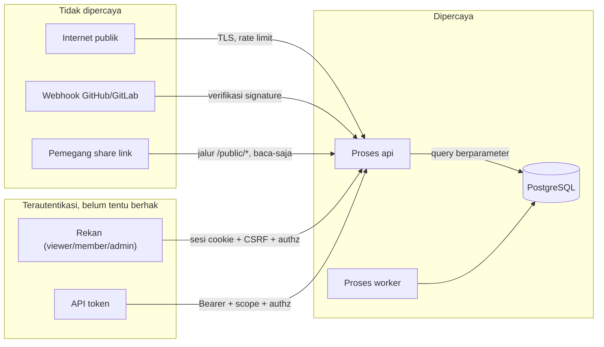

# Threat Model

Sistem ini tidak menangani uang, tapi menyimpan data pribadi rekan: nama,
email, isi komentar, dan jam kerja. Itu cukup untuk menuntut model ancaman —
walau ringkas.

## Yang berharga

Diurutkan menurut kerugian kalau bocor atau rusak.

| Aset | Kerugian kalau bocor | Kerugian kalau hilang |
|---|---|---|
| Kredensial VCS (`vcs_connections`) | **Tertinggi.** Memberi akses tulis ke repositori kode | Rendah — bisa dibuat ulang |
| Password hash & sesi | Pengambilalihan akun | Rendah |
| Isi kartu & komentar | Kebocoran rencana kerja, diskusi internal | **Tertinggi** — pekerjaan berbulan-bulan |
| Email & nama pengguna | Kebocoran data pribadi | Sedang |
| API token | Akses program penuh sesuai scope | Rendah |
| Jam kerja (`time_logs`) | Sensitif secara sosial di dalam tim | Sedang |
| Riwayat (`activity_events`) | Merekonstruksi seluruh isi kartu | Tinggi — laporan kehilangan dasar |

## Siapa penyerangnya

| Pelaku | Kemampuan | Motif |
|---|---|---|
| Pemindai otomatis di internet | Tinggi frekuensi, rendah kecanggihan | Mencari CVE, panel admin, kredensial default |
| Orang yang menemukan share link | Punya URL yang sah | Rasa ingin tahu, atau tautan diteruskan ke pihak ketiga |
| Rekan yang diundang (`viewer`/`contributor`) | Terautentikasi, tahu bentuk API | Melihat project lain, membaca jam kerja orang lain, mengubah tulisan orang lain |
| Mantan rekan yang aksesnya dicabut | Pernah tahu ID dan struktur | Akses lanjutan lewat sesi atau token yang tidak dicabut |
| Penyerang XSS lewat isi kartu | Bisa menulis Markdown | Mencuri sesi, bertindak atas nama korban |
| Penyerang webhook | Bisa mengirim POST ke endpoint publik | Memalsukan event, memicu automation |

Yang **tidak** dimodelkan: penyerang dengan akses fisik ke VPS, penyedia
infrastruktur yang jahat, dan serangan rantai pasok pada dependensi (dimitigasi
lewat audit CI, bukan dicegah).

## Batas kepercayaan

Tiga batas yang paling rawan, berurutan menurut risiko: `member → api`
(otorisasi tingkat objek), `wh → api` (verifikasi signature), `share → api`
(permukaan tanpa autentikasi).

## STRIDE

### Spoofing — berpura-pura jadi orang lain

| Ancaman | Mitigasi | Fase |
|---|---|---|
| Menebak token sesi | 256-bit dari `crypto/rand`, hanya hash yang disimpan | 0 |
| Kredensial dicoba paksa | Rate limit per akun **dan** per IP; Argon2id | 0 |
| Enumerasi akun lewat login | Respons identik untuk email tidak terdaftar dan password salah | 0 |
| Enumerasi akun lewat undangan / reset password | Respons identik apa pun hasilnya; pesan dikirim lewat email, bukan lewat respons API | 0 |
| Enumerasi akun lewat **waktu jawab** reset password | **Belum ditutup — sisa risiko yang diterima.** Lihat di bawah | 0 |
| Webhook palsu | Verifikasi signature **sebelum** body disentuh logika apa pun | 9 |
| Sesi mantan rekan masih hidup | Mengeluarkan anggota mencabut seluruh sesi dan token miliknya | 2 |

### Tampering — mengubah yang tidak boleh diubah

| Ancaman | Mitigasi | Fase |
|---|---|---|
| SQL injection | Query berparameter selalu, lewat `sqlc`/`pgx`. Builder filter dinamis pun berparameter | 0 |
| Mengubah komentar orang lain | Matriks: **admin pun tidak boleh** mengubah tulisan orang lain | 2 |
| Mengubah `activity_events` | Tabel hanya di-`INSERT`. Tidak ada endpoint yang meng-`UPDATE` atau `DELETE`-nya | 1 |
| Mengubah `project.key` | Tidak ada endpoint untuk itu, untuk siapa pun | 1 |
| Menyisipkan kartu ke project lain lewat `status_id` | FK komposit `(status_id, project_id)` di database | 1 |
| Automation memicu dirinya tanpa henti | `automation_runs.depth` dengan `CHECK (depth <= 5)` — constraint database, bukan hanya kode | 7 |

### Repudiation — menyangkal telah melakukan

| Ancaman | Mitigasi | Fase |
|---|---|---|
| "Bukan saya yang memindahkan kartu itu" | Setiap perubahan menulis `activity_events` dalam transaksi yang sama | 1 |
| Owner membaca project diam-diam | Owner menambahkan diri sebagai admin **tercatat dan memberi notifikasi ke anggota** | 2 |
| Ekspor data tanpa jejak | Ekspor tercatat di `activity_events`: siapa, project mana, kapan | 1 |

### Information disclosure — bocor ke yang tidak berhak

| Ancaman | Mitigasi | Fase |
|---|---|---|
| **IDOR — membaca kartu project lain** | Otorisasi tingkat objek di `internal/authz`, `404` bukan `403`. **Ini kelas kerentanan paling sering lolos review** | 1–2 |
| `viewer` membaca jam kerja orang lain | Matriks: `time_logs` hanya milik sendiri; agregat hanya `admin` | 6 |
| Share link membocorkan komentar | Jalur `/public/*` mengembalikan bentuk data terpangkas — bukan endpoint biasa dengan pengecualian | 9 |
| Share link diteruskan ke pihak ketiga | `expires_at`, bisa dicabut, dan pembuatannya tercatat. **Tidak bisa dicegah sepenuhnya** — ini risiko yang diterima |
| Pesan error membocorkan internal | Bentuk error seragam; stack trace dan SQL hanya di log server, klien menerima `request_id` | 0 |
| Data pribadi masuk log | Daftar kolom 🔒 di [data-model.md](data-model.md); log memuat ID, bukan isi | 0 |
| Kredensial VCS terbaca admin | `credential_enc` terenkripsi AES-GCM, **tidak pernah** dikembalikan API | 9 |
| Secret pernah ter-commit | `.env` di `.gitignore`, `.env.example` bernilai kosong. Kalau pernah ter-commit: **rotasi**, tidak cukup dihapus dari riwayat | 0 |

### Denial of service

| Ancaman | Mitigasi | Fase |
|---|---|---|
| Body permintaan raksasa | `http.MaxBytesReader` di seluruh route | 0 |
| Query tanpa batas | `LIMIT` di setiap query; `limit` maksimum dipaksakan server | 0 |
| Koneksi menggantung | `ReadTimeout`, `WriteTimeout`, `IdleTimeout` di server; `statement_timeout` dan `idle_in_transaction_session_timeout` di PostgreSQL | 0 |
| Pencarian yang mahal diulang-ulang | Rate limit pada endpoint pencarian | 3 |
| Banjir webhook | Rate limit per koneksi VCS; pemrosesan asinkron lewat antrean | 9 |
| Automation yang meledak | Batas kedalaman + antrean, bukan eksekusi sinkron | 7 |
| Kolam koneksi habis | Pool dibatasi sadar per instance; PgBouncer kalau perlu | 0 |

### Elevation of privilege

| Ancaman | Mitigasi | Fase |
|---|---|---|
| Pegawai menaikkan peran akunnya sendiri | Peran ada di akun dan **hanya `owner` yang boleh mengubahnya** ([ADR-0012](adr/0012-peran-akun-dan-akses-owner.md)). Tidak ada endpoint yang membiarkan siapa pun menyentuh perannya sendiri | 2 |
| Project terkunci karena tidak ada lagi yang bisa mengaturnya | Tidak mungkin sejak ADR-0012: `owner` mengakses setiap project tanpa perlu jadi anggota, dan aksesnya tercatat | 2 |
| API token dibuat dengan scope melebihi hak penggunanya | Scope divalidasi terhadap peran nyata saat pembuatan **dan** saat pemakaian | 9 |
| XSS lewat deskripsi kartu → mencuri sesi | Markdown di-render tanpa `dangerouslySetInnerHTML` pada konten pengguna; HTML mentah tidak diizinkan. Sesi di cookie `HttpOnly` sehingga XSS tidak langsung berarti pencurian token | 1 |
| CSRF dari situs lain | `SameSite=Lax` + double-submit token, ditegakkan di level router | 0 |

## Yang diterima sebagai risiko

Ditulis eksplisit supaya tidak terlihat seperti kelalaian.

| Risiko | Alasan diterima |
|---|---|
| Share link yang bocor memberi akses baca ke satu board | Itu memang fungsinya. Dimitigasi dengan kedaluwarsa dan pencabutan, bukan dihilangkan |
| Tidak ada 2FA | Instalasi pribadi dengan pengguna yang dikenal. Kalau nanti ada rekan di luar lingkaran dekat, ini harus ditinjau ulang |
| Tidak ada enkripsi at-rest di tingkat kolom selain kredensial VCS | Disk VPS terenkripsi; ancaman akses fisik tidak dimodelkan |
| Serangan rantai pasok pada dependensi | Dimitigasi (`govulncheck`, `pnpm audit`, lockfile di-commit), tidak dicegah |
| Owner pada akhirnya bisa membaca project mana pun | Hanya lewat langkah yang tercatat dan memberi notifikasi. Perbedaan antara akses darurat dan akses diam-diam |
| **Waktu jawab `POST /auth/password/reset` membocorkan apakah sebuah alamat punya akun** | Lihat di bawah |

### Waktu jawab reset password

`POST /auth/password/reset` menjawab `202` dengan body kosong apa pun
hasilnya, dan itu menutup enumerasi lewat isi respons. Yang belum tertutup
adalah **berapa lama respons itu datang**: alamat yang punya akun menjalankan
satu perjalanan SMTP di dalam jalur permintaan, alamat yang tidak punya
langsung menjawab. Selisihnya cukup besar untuk diukur dengan stopwatch.

Diterima sekarang karena dua alternatifnya lebih buruk hari ini:

- **Goroutine di proses API** membuat waktunya konstan, tapi surel bisa hilang
  di setiap deploy — proses tidak menunggu goroutine sebelum berhenti, dan
  tidak ada tempat mencatat yang gagal.
- **Penundaan buatan** menyamakan waktu dengan menambah lambat untuk semua
  orang, dan angkanya harus ditebak ulang setiap kali server surel berubah.

**Yang menutupnya sudah ada di rencana:** pengiriman lewat `outbox`
([ADR-0002](adr/0002-event-transport-outbox.md)) yang dikonsumsi `cmd/worker`
(Langkah 24). Begitu worker itu ada, permintaan reset hanya menulis baris dan
waktunya berhenti bergantung pada apakah ada yang perlu dikirimi.

Sampai saat itu, yang membatasi dampaknya adalah rate limit: 3 per jam per
akun dan 10 per jam per alamat IP ([ADR-0010](adr/0010-ip-klien-dan-rate-limit.md)),
yang membuat pemindaian daftar alamat mahal — bukan mustahil.

## Kapan dokumen ini ditinjau ulang

- Sebelum merge Fase 2 (otorisasi multi-user)
- Sebelum merge Fase 9 (share link, API publik, webhook)
- Kalau ada pengguna di luar lingkaran dekat diundang
- Setelah setiap insiden keamanan, sekecil apa pun
